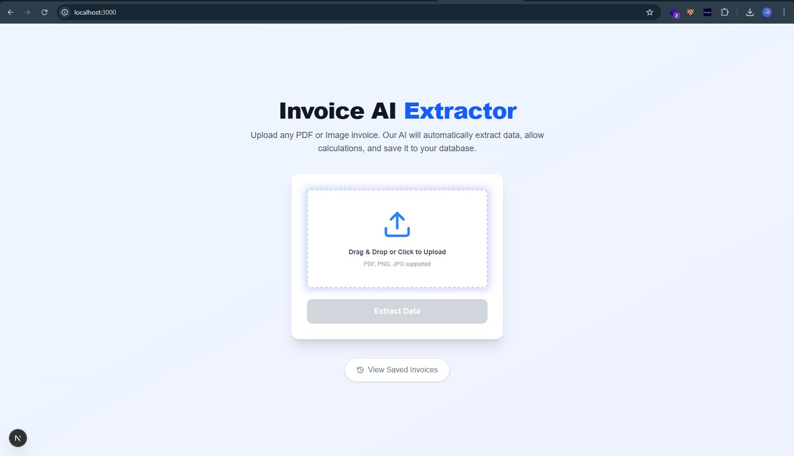
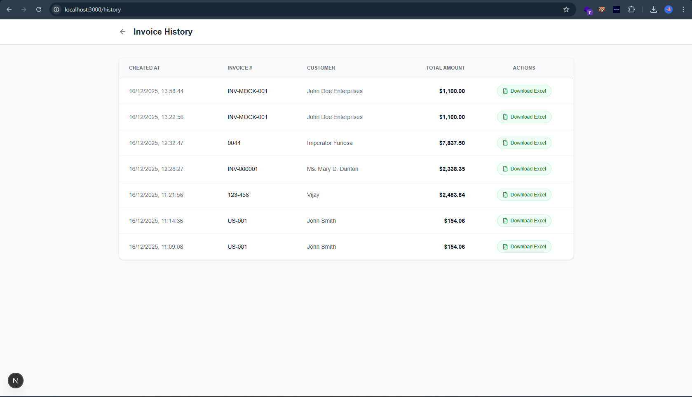

# 🧾 AI Invoice Extraction System


A powerful, AI-powered invoice extraction and management system. This application allows users to upload invoice images/PDFs, automatically extracts key data (Client info, Line items, Totals) using LLMs, and provides a seamless UI to review, edit, and save the data to an Excel database.

## 🌟 Key Features

*   **📄 AI-Powered Extraction**: Automatically detects and extracts structured data from non-standard invoice formats.
*   **✏️ Live Review & Edit**: Interactive UI to review extracted data with **real-time recalculation** of totals, tax, and subtotals.
*   **💾 Excel Database Integration**: Uses local Excel files (`.xlsx`) as a lightweight, portable database. No SQL setup required.
*   **📜 History & Analytics**: View a history of all saved invoices with sorting and search capabilities.
*   **⬇️ Export Support**: Download individual invoices as formatted Excel files.
*   **🎨 Modern UI/UX**: Built with Next.js and Tailwind CSS for a professional, responsive, and clean user experience.

---

## 📸 Screenshots

### 1. Dashboard & Upload
*Seamless drag-and-drop interface for uploading invoices.*


### 2. Intelligent Extraction & Editing
*Review extracted data, edit line items, and see instant calculations.*


### 3. History & Management
*Track past invoices and download records.*


---

## 🛠️ Tech Stack

### Backend (Python/Flask)
*   **Framework**: Flask
*   **AI Service**: OpenAI / Custom LLM Service
*   **Data Processing**: Pandas, OpenPyXL
*   **OCR**: PyPDF, OCR tools

### Frontend (TypeScript/Next.js)
*   **Framework**: Next.js 14 (App Router)
*   **Styling**: Tailwind CSS
*   **Icons**: Lucide React
*   **HTTP Client**: Axios

---

## 🚀 Getting Started

### Prerequisites
*   **Python 3.8+**
*   **Node.js 18+**
*   **OpenAI API Key** (for AI extraction features)

### 1. Clone the Repository
```bash
git clone https://github.com/Rishifx/Invoice-AI-Extractor.git
cd Invoice-AI-Extractor
```

### 2. Backend Setup
Navigate to the root directory where `app.py` is located.
```bash
# Install Python dependencies
pip install -r requirements.txt

# Create .env file for API keys
echo "OPENAI_API_KEY=your_key_here" > .env

# Run the Flask Server
python app.py
```
*Server runs on `http://localhost:5000`*

### 3. Frontend Setup
Navigate to the `frontend` directory.
```bash
cd frontend

# Install dependencies
npm install

# Run the Development Server
npm run dev
```
*App runs on `http://localhost:3000`*

---

## 📂 Project Structure

```
├── app.py                 # Flask Validation & Routes
├── services/              # Business Logic (OCR, Excel, LLM)
├── data/                  # Excel Database Storage (Generated)
├── frontend/              # Next.js Frontend Application
│   ├── app/               # App Router Pages
│   │   ├── page.tsx       # Home/Upload
│   │   ├── result/        # Review & Edit Page
│   │   └── history/       # History Page
│   └── public/            # Static Assets
└── requirements.txt       # Python Dependencies
```

---

## 🤝 Contributing

Contributions are welcome! Please feel free to submit a Pull Request.

1.  Fork the Project
2.  Create your Feature Branch (`git checkout -b feature/AmazingFeature`)
3.  Commit your Changes (`git commit -m 'Add some AmazingFeature'`)
4.  Push to the Branch (`git push origin feature/AmazingFeature`)
5.  Open a Pull Request

---

## 📄 License

Distributed under the MIT License. See `LICENSE` for more information.

---

Made with ❤️ by [Your Name]
